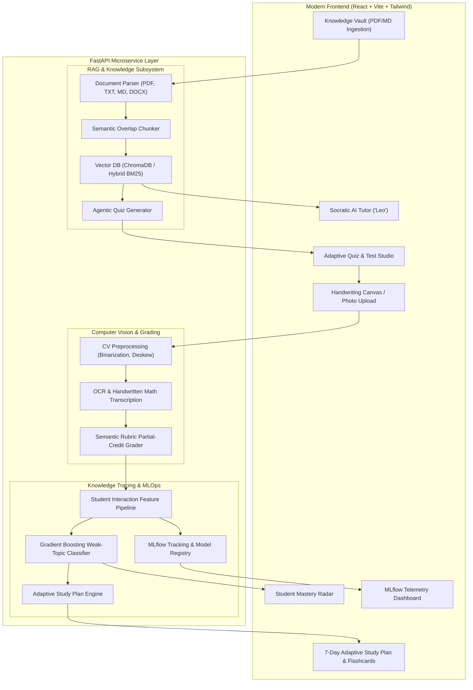

# 🎓 End-to-End AI Tutor Platform

[](https://python.org)
[](https://fastapi.tiangolo.com)
[](https://react.dev)
[](https://vitejs.dev)
[](https://mlflow.org)
[](https://trychroma.com)
[](https://opensource.org/licenses/MIT)

> An enterprise-grade, multimodal AI Tutoring Platform that transforms lecture notes and textbooks into an adaptive, personalized learning experience. Featuring **RAG Knowledge Retrieval**, **Quiz-Generation Agents**, **Computer Vision/OCR Handwritten Answer Grading**, **MLflow-Tracked Weak-Topic Knowledge Tracing**, and an **Interactive Socratic AI Tutor**.

---

## 🌟 System Architecture



---

## 🚀 Key Feature Highlights

### 1. 📚 RAG Knowledge Vault & Hybrid Search
- Ingests **PDF textbooks, Markdown files, Word documents, and lecture notes**.
- Performs intelligent chunking with semantic overlap, metadata tagging, and topic extraction.
- Dense semantic embeddings indexed in **ChromaDB** with hybrid keyword search fallback.

### 2. ⚡ Agentic Quiz Generation Studio
- Dynamic AI agent synthesizes multi-format assessments:
  - **Multiple Choice Questions (MCQs)** with distractor generation.
  - **Short-Answer Conceptual Questions** with keyword coverage analysis.
  - **Handwritten Mathematical Derivations** with step-by-step point rubrics.
- Adaptive difficulty scaling (Easy, Medium, Hard).

### 3. ✍️ Multimodal Handwriting Lab & Computer Vision Grading
- **Interactive HTML5 Drawing Canvas**: Draw equations, mathematical proofs, and architectural diagrams directly on screen with a digital pen/stylus.
- **Photo Upload**: Supports uploading photos or scanned pages from physical notebooks.
- **Computer Vision Pipeline**: Adaptive binarization, contrast normalization, stroke density analysis, and OCR transcription.
- **Diagnostic Rubric Evaluator**: Compares student derivations against step-by-step criteria, granting partial credit and detecting misconceptions.

### 4. 🧠 Knowledge Tracing & Weak-Topic Prediction (Classical ML + NLP)
- Feature engineering extracts latency, error streaks, historical accuracy, forgetting curve decay factors, and handwritten scores.
- Scikit-Learn & HistGradientBoosting Classifier predicts the probability of student concept failure.
- Visual **Mastery Radar Chart** tracking concept competencies in real-time.

### 5. 🔬 MLOps with MLflow
- Full experiment tracking logging:
  - Model architectures (`Hist_Gradient_Boosting`, `Random_Forest`, `Logistic_Regression`).
  - Validation metrics: Accuracy, Precision, Recall, F1-Score, ROC-AUC.
  - Artifacts: Confusion Matrices, ROC Curves, and production `.joblib` model binaries.
- Model registry and telemetry dashboard built right into the web interface.

### 6. 📅 7-Day Personalized Remediation Plan & Flashcards
- Generates tailored daily micro-learning schedules focusing on flagged weak topics.
- Interactive 3D flip flashcards for active recall and equation memorization.

### 7. 🤖 Socratic AI Tutor ("Leo")
- Interactive slide-over conversational tutor agent.
- Scaffolds learning through progressive hints and inquiry rather than simply giving away solutions.
- Grounded citations back to the student's indexed notes.

---

## 🛠️ Technology Stack

| Layer | Technologies |
|---|---|
| **Frontend** | React 18, Vite, TailwindCSS, Lucide React, HTML5 Canvas API, Canvas Confetti |
| **Backend** | FastAPI, Uvicorn, Pydantic v2, Python 3.12 |
| **Vector DB & RAG** | ChromaDB, Sentence-Transformers, PyPDF, Python-docx |
| **Machine Learning & MLOps** | Scikit-Learn, LightGBM / HistGradientBoosting, MLflow, Pandas, NumPy, Matplotlib, Seaborn |
| **Computer Vision** | Pillow (PIL), OpenCV, Gemini Multimodal Vision API (optional fallback) |
| **DevOps & Containers** | Docker, Docker Compose, Git |

---

## 💻 Local Setup & Quickstart

### Prerequisites
- Python 3.12+ (or 3.11)
- Node.js 18+ and npm
- Git

### 1. Clone the Repository
```bash
git clone https://github.com/Udipto-Mondal/ai-tutor-platform.git
cd ai-tutor-platform
```

### 2. Backend Setup
```bash
# Create and activate virtual environment
python -m venv venv

# Windows
.\venv\Scripts\activate
# Linux/macOS
source venv/bin/activate

# Install dependencies
pip install -r backend/requirements.txt

# (Optional) Set API keys in .env
cp .env.example .env
```

### 3. Run Knowledge Tracing MLOps Pipeline
Train the weak-topic prediction models and log runs to MLflow:
```bash
python mlops/train_knowledge_model.py
```
*(Optional: View MLflow dashboard via `mlflow ui`)*

### 4. Start the FastAPI Backend Server
```bash
uvicorn backend.app.main:app --host 0.0.0.0 --port 8000 --reload
```
API Documentation will be available at: `http://localhost:8000/docs`

### 5. Frontend Setup
In a new terminal:
```bash
cd frontend
npm install
npm run dev
```
Open your browser at: `http://localhost:5173`

---

## 🐳 Docker Deployment

Run the entire full-stack application using Docker Compose:

```bash
docker-compose up --build
```
- **Web App**: `http://localhost:3000`
- **Backend API**: `http://localhost:8000`
- **Interactive Swagger Docs**: `http://localhost:8000/docs`

---

## 🧪 Running Automated Tests

Run the test suite covering RAG indexing, agents, vision grading, and ML prediction:

```bash
pytest backend/tests -v
```

---

## 📂 Project Directory Structure

```
ai-tutor-platform/
├── backend/
│   ├── app/
│   │   ├── api/                  # FastAPI REST Route handlers
│   │   │   ├── routes_documents.py
│   │   │   ├── routes_quiz.py
│   │   │   ├── routes_grading.py
│   │   │   ├── routes_analytics.py
│   │   │   ├── routes_study_plan.py
│   │   │   ├── routes_tutor.py
│   │   │   └── routes_mlops.py
│   │   ├── core/                 # Config & application settings
│   │   ├── db/                   # Storage & persistence layer
│   │   ├── models/               # Pydantic schemas & data models
│   │   ├── services/
│   │   │   ├── rag/              # Ingestion, ChromaDB & Quiz Agent
│   │   │   ├── vision/           # Preprocessor & OCR Rubric Grader
│   │   │   ├── ml/               # Knowledge Tracing & Study Plan
│   │   │   └── agent/            # Socratic AI Tutor Engine
│   │   └── main.py               # Application entrypoint
│   ├── requirements.txt
│   └── tests/                    # Pytest unit & integration tests
├── data/
│   ├── sample_materials/         # Built-in study notes (DL, Algorithms)
│   ├── ml_data/                  # Interaction datasets
│   └── models/                   # Serialized ML models & metadata
├── frontend/
│   ├── src/
│   │   ├── components/           # React Glassmorphism components
│   │   ├── App.jsx               # Main application container
│   │   ├── index.css             # Design tokens & animations
│   │   └── main.jsx
│   ├── package.json
│   └── vite.config.js
├── mlops/
│   ├── generate_student_data.py  # Synthetic trajectory generator
│   └── train_knowledge_model.py  # MLflow training & tracking pipeline
├── docker-compose.yml
├── Dockerfile.backend
├── Dockerfile.frontend
├── .env.example
├── .gitignore
└── README.md
```

---

## 👤 Author
- **Udipto Mondal** - [GitHub: @Udipto-Mondal](https://github.com/Udipto-Mondal)
